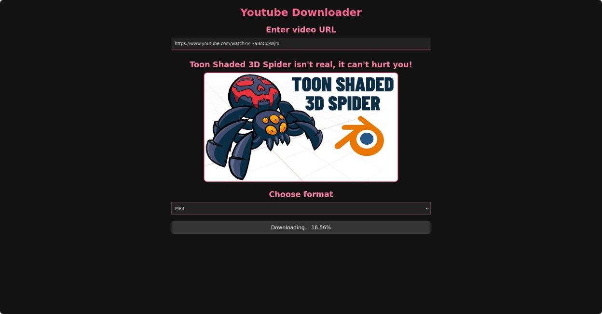

# NodeJS Youtube Downloader 📥 🎥


A simple yet powerful NodeJS Youtube Downloader application with a ReactJS frontend, all coded in TypeScript. This project allows you to download Youtube videos directly through a user-friendly web interface.


## Preview 📺


## Features ✨
- Download videos directly from Youtube.
- Select between different video formats.
- Simple and responsive UI.
- Full TypeScript setup.

## Installation 🔧
1. Clone the repository:
```bash
git clone https://github.com/thenolle/nodejs-youtube-downloader.git
cd nodejs-youtube-downloader
```
2. Install dependencies:
```bash
# if using npm
npm install
# if using pnpm (recommended)
pnpm install
```
3. Build and run the application:
```bash
# if using npm
npm run build
npm start
npm run server
# if using pnpm
pnpm build
pnpm start
pnpm run server
```

## Contributing 🤝
Contributions, issues, and feature requests are welcome! Feel free to check [issues page](https://github.com/thenolle/nodejs-youtube-downloader/issues). You can also take a look at the [contributing guide](CONTRIBUTING.md).

## License 📝
This project is [MIT Licensed](LICENSE).

## Support 💖
Give a ⭐️ if this project helped you!

## Author 👨‍💻
- X (twitter): [@TheNolle](https://twitter.com/thenolly_)
- Website: [thenolle.com](https://thenolle.com)
- Github: [@TheNolle](https://github.com/thenolle)
- Patreon: [Support Me](https://patreon.com/_nolly)
- Buy Me A Coffee: [Donate](https://www.buymeacoffee.com/thenolle)
- Ko-fi: [Donate](https://ko-fi.com/nolly__)